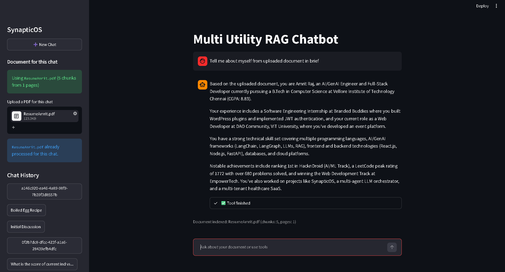

<div align="center">

```
╔══════════════════════════════════════════════════════════════════════════════════╗
║ ███████╗██╗   ██╗███╗   ██╗ █████╗ ██████╗ ████████╗██╗ ██████╗ ██████╗ ███████╗ ║
║ ██╔════╝╚██╗ ██╔╝████╗  ██║██╔══██╗██╔══██╗╚══██╔══╝██║██╔════╝██╔═══██╗██╔════╝ ║
║ ███████╗ ╚████╔╝ ██╔██╗ ██║███████║██████╔╝   ██║   ██║██║     ██║   ██║███████╗ ║
║ ╚════██║  ╚██╔╝  ██║╚██╗██║██╔══██║██╔═══╝    ██║   ██║██║     ██║   ██║╚════██║ ║
║ ███████║   ██║   ██║ ╚████║██║  ██║██║        ██║   ██║╚██████╗╚██████╔╝███████║ ║
║ ╚══════╝   ╚═╝   ╚═╝  ╚═══╝╚═╝  ╚═╝╚═╝        ╚═╝   ╚═╝ ╚═════╝ ╚═════╝ ╚══════╝ ║
║                               S y n a p t i c O S                                ║
║                                                                                  ║
╚══════════════════════════════════════════════════════════════════════════════════╝
```

# SynapticOS

### Production-grade Agentic RAG Platform with Persistent Memory, HITL Orchestration & LangSmith Observability



<br/>

[](https://python.org)
[](https://langchain.com)
[](https://smith.langchain.com)
[](https://langchain-ai.github.io/langgraph)
[](LICENSE)
[]()

</div>

---

## 📌 Table of Contents

- [Overview](#-overview)
- [Architecture](#-architecture)
- [Core Features](#-core-features)
- [Tech Stack](#-tech-stack)
- [Project Structure](#-project-structure)
- [Getting Started](#-getting-started)
- [Environment Variables](#-environment-variables)
- [Feature Deep Dives](#-feature-deep-dives)
  - [Advanced RAG Pipeline](#advanced-rag-pipeline)
  - [Persistent Memory](#persistent-memory)
  - [HITL Orchestration](#hitl-orchestration)
  - [Retry Mechanism](#retry-mechanism)
  - [External Tool Integration](#external-tool-integration)
  - [LangSmith Observability](#langsmith-observability)
- [UI Overview](#-ui-overview)
- [Roadmap](#-roadmap)
- [Contributing](#-contributing)
- [License](#-license)

---

## 🧠 Overview

Most AI demos stop at "send a message, get a reply." **SynapticOS** is built differently.

It implements a full **agentic loop** — where the AI can reason across multiple turns, retrieve grounded knowledge via Advanced RAG, remember past conversations via persistent memory, pause for human review at critical decision points (HITL), recover gracefully from failures via retry logic, call external tools, and expose all of this through a clean UI — with every single trace observable in **LangSmith**.

This project was designed to reflect **real-world production AI system design**, not tutorial-grade scaffolding.

---

## 🏗 Architecture

```
┌─────────────────────────────────────────────────────────────────────────────┐
│                              SynapticOS Engine                              │
│                                                                             │
│   ┌──────────┐     ┌─────────────────────────────────────────────────────┐  │
│   │   UI     │───▶│              LangGraph Orchestrator                │  │
│   │ (Chat    │     │                                                    │  │
│   │  Panel)  │     │  ┌──────────┐  ┌──────────┐  ┌────────────────┐    │  │
│   └──────────┘     │  │  Intent  │  │   RAG    │  │  Tool Executor │    │  │
│                    │ │  Router  │─▶│ Retrieval│  │ (Web / Custom) │    │  │
│   ┌──────────┐     │  └──────────┘  └──────────┘  └────────────────┘    │  │
│   │LangSmith │◀───│        │              │                │            │  │
│   │Tracing   │     │       ▼              ▼                ▼            │  │
│   └──────────┘     │  ┌──────────────────────────────────────────────┐  │  │
│                    │  │              LLM Core (GPT / Claude)         │  │  │
│   ┌──────────┐     │  └──────────────────────────────────────────────┘  │  │
│   │Persistent│     │        │                                           │  │
│   │ Memory   │◀────│       ▼                                            │  │
│   │(ChromaDB │     │  ┌──────────┐     ┌──────────────────────┐         │  │
│   │/ SQLite) │     │  │  HITL    │────▶│   Retry / Fallback   │        │  │
│   └──────────┘     │  │Checkpoint│     │   Logic              │        │  │
│                    │  └──────────┘     └──────────────────────┘        │  │
│                    └─────────────────────────────────────────────────────┘  │
└─────────────────────────────────────────────────────────────────────────────┘
```

**Data flow:**
1. User sends a message via the UI
2. LangGraph router classifies intent and determines the execution path
3. RAG pipeline retrieves relevant grounded context
4. External tools are invoked if required
5. The LLM generates a response using memory + retrieved context + tool outputs
6. HITL checkpoint intercepts high-stakes decisions for human approval
7. Retry logic handles failures and reformulates if output quality is insufficient
8. Final response is delivered and the full trace is logged to LangSmith
9. Memory is updated with the new turn for future context

---

## ✨ Core Features

| Feature | Description |
|---|---|
| 🔍 **Advanced RAG** | Chunking, embedding, vector retrieval with re-ranking and context compression |
| 🧬 **Persistent Memory** | Cross-session memory storage — the agent remembers who you are and what was discussed |
| 👁️ **HITL Orchestration** | Human-in-the-Loop checkpoints that pause execution for review before critical actions |
| 🔁 **Retry Mechanism** | Automatic retry with exponential backoff and output quality re-evaluation |
| 🛠️ **External Tools** | Pluggable tool integrations — web search, custom APIs, file readers, and more |
| 📊 **LangSmith Observability** | Full trace logging, latency metrics, and chain visualization for every run |
| 💬 **Multi-turn Chat UI** | Clean, responsive chat interface with session management |
| 🏗️ **LangGraph Workflows** | Stateful, conditional agent graphs with branching and loop support |

---

## 🛠 Tech Stack

```
Core Framework     → LangChain + LangGraph
LLM Backend        → OpenAI GPT-4o / Anthropic Claude (configurable) / Gemini
RAG Pipeline       → FAISS / ChromaDB + HuggingFace Embeddings
Memory Store       → ChromaDB (vector) + SQLite (session metadata)
Observability      → LangSmith
UI                 → Streamlit 
Retry Logic        → Tenacity + Custom LangGraph nodes
Tool Integration   → LangChain Tools + Custom wrappers
Language           → Python 3.10+
```

---

## 📁 Project Structure

```
SynapticOS/
│
├── assets/
│   └── demo-streamlit.png      # Application demo screenshot
│
├── streamlit_frontend.py       # Streamlit user interface
├── langgraph_backend.py        # LangGraph workflow, tools, memory & RAG logic
├── chatbot.db                  # SQLite database for chat persistence
├── requirements.txt            # Python dependencies
├── .gitignore                  # Git ignore rules
└── README.md

```

---

## 🚀 Getting Started

### Prerequisites

- Python 3.10 or higher
- An OpenAI or Anthropic or Gemini API Key
- A LangSmith account (free tier works)

### Installation

```bash
# 1. Clone the repository
git clone https://github.com/Yes-Amrit/SynapticOS.git
cd SynapticOS

# 2. Create and activate a virtual environment
python -m venv venv
source venv/bin/activate        # On Windows: venv\Scripts\activate

# 3. Install dependencies
pip install -r requirements.txt

# 4. Set up environment variables
cp .env.example .env
# Edit .env with your API keys (see section below)

# 5. Run the application
streamlit run ui/app.py
```

The app will be available at `http://localhost:8501`

---

## 🔐 Environment Variables

Create a `.env` file in the root directory using the template below:

```env
# ── Gemini API ────────────────────────────────────────────────
GOOGLE_API_KEY=your_google_api_key_here
OPENAI_API_KEY=your_openai_api_key_here
ANTHROPIC_API_KEY=your_anthropic_api_key_here       # any one

# ── LangSmith Observability ───────────────────────────────────
LANGCHAIN_TRACING_V2=true
LANGCHAIN_ENDPOINT=https://api.smith.langchain.com
LANGCHAIN_API_KEY=your_langsmith_api_key_here
LANGCHAIN_PROJECT=chatbot

# ── Stock Market Tool ─────────────────────────────────────────
ALPHA_VANTAGE_KEY=your_alpha_vantage_api_key_here
```

---

## 🔬 Feature Deep Dives

### Advanced RAG Pipeline

SynapticOS implements a multi-stage retrieval pipeline that goes beyond naive vector search:

```
Document Ingestion
      │
      ▼
Semantic Chunking  ──▶  Overlap-aware splitting with configurable chunk size
      │
      ▼
Embedding          ──▶  HuggingFace sentence-transformers (swappable)
      │
      ▼
Vector Storage     ──▶  ChromaDB (persistent) or FAISS (in-memory)
      │
      ▼
Retrieval          ──▶  Top-K similarity search
      │
      ▼
Re-Ranking         ──▶  Cross-encoder reranking for precision
      │
      ▼
Context Compression──▶  LLM-based compression to reduce noise before generation
```

> Result: The LLM always receives a concise, highly relevant, grounded context window — not a raw dump of chunks.

---

### Persistent Memory

Unlike standard chatbots that forget everything on session end, SynapticOS maintains two memory layers:

| Layer | Scope | Backend | Purpose |
|---|---|---|---|
| **Short-term** | Current session | In-memory buffer | Immediate context within a conversation |
| **Long-term** | Cross-session | ChromaDB + SQLite | User preferences, past topics, stored facts |

Memory is automatically written at the end of each turn and retrieved at the start of every new session — giving the agent a continuous sense of who it's talking to.

---

### HITL Orchestration

Human-in-the-Loop (HITL) checkpoints are embedded directly into the LangGraph execution graph. When a node's confidence score falls below a configurable threshold, execution **pauses** and routes to a human review interface before proceeding.

```
Agent generates action
         │
         ▼
  Confidence check
    /           \
 HIGH            LOW
  │               │
  ▼               ▼
Execute     Pause & notify human
               │
        Human approves/edits
               │
               ▼
          Resume execution
```

This is particularly useful for high-stakes tool calls, sensitive document retrieval, or any action where hallucination risk is elevated.

---

### Retry Mechanism

SynapticOS uses a combination of **Tenacity** and custom LangGraph fallback nodes to handle failures gracefully:

```python
# Simplified retry logic
@retry(
    stop=stop_after_attempt(3),
    wait=wait_exponential(multiplier=1, min=2, max=10),
    retry=retry_if_exception_type(LLMException)
)
def invoke_with_retry(chain, inputs):
    response = chain.invoke(inputs)
    if not quality_check(response):
        raise OutputQualityError("Response did not meet quality threshold")
    return response
```

Retry triggers on:
- LLM API timeouts or rate limits
- Empty or malformed responses
- Output quality score below threshold
- Tool call failures

---

### External Tool Integration

Tools are registered as standard LangChain tools and injected into the agent's tool belt at initialization:

```python
tools = [
    WebSearchTool(),        # Live web search via Serper API
    FileReaderTool(),       # Parse and read uploaded documents
    CalculatorTool(),       # Numerical computation
    CustomAPITool(),        # Extendable — plug in any REST API
]
```

Adding a new tool requires only implementing the `BaseTool` interface — no changes to the core graph.

---

### LangSmith Observability

Every run in SynapticOS is fully traced in LangSmith — including:

- Full input/output at every node
- Chain-level and node-level latency
- Token usage per call
- Retry attempts and fallback activations
- HITL checkpoint events
- Memory read/write operations

To view traces, log in to [smith.langchain.com](https://smith.langchain.com) and navigate to the `SynapticOS` project.

---

## 🖥 UI Overview

SynapticOS ships with a clean multi-turn chat interface built on **Streamlit**:

```
┌─────────────────────────────────────────────────────────┐
│  SynapticOS                                 [⚙ Settings]│
├──────────────┬──────────────────────────────────────────┤
│              │                                          │
│  Sessions    │   Chat Area                              │
│  ──────────  │   ─────────                              │
│  > Session 1 │   User: What did we discuss last time?   │
│    Session 2 │                                          │
│    Session 3 │   Agent: Based on our previous session,  │
│              │   you were working on...                 │
│  [+ New]     │                                          │
│              │   [HITL Review Pending ⚠️]               │
│  Memory      │   Action: Searching web for X            │
│  ──────────  │   [Approve] [Edit] [Reject]              │
│  5 facts     │                                          │
│  stored      ├──────────────────────────────────────────┤
│              │  Type a message...            [Send →]   │
└──────────────┴──────────────────────────────────────────┘
```

---

## 🗺 Roadmap

- [x] Core LangGraph orchestration graph
- [x] Advanced RAG pipeline with re-ranking
- [x] Persistent cross-session memory
- [x] HITL checkpoint system
- [x] Retry and fallback mechanism
- [x] External tool integration
- [x] LangSmith full-trace observability
- [x] Chat UI with session management
- [ ] Multi-agent collaboration support
- [ ] Voice input / output interface
- [ ] Docker containerization
- [ ] REST API layer for external integrations
- [ ] Role-based access control for HITL reviewers
- [ ] Fine-tuned domain-specific embedding models

---

## 🤝 Contributing

Contributions are welcome. To contribute:

```bash
# 1. Fork the repository
# 2. Create a feature branch
git checkout -b feature/your-feature-name

# 3. Commit your changes
git commit -m "feat: add your feature description"

# 4. Push and open a Pull Request
git push origin feature/your-feature-name
```

Please follow [Conventional Commits](https://www.conventionalcommits.org/) for commit messages.

---

## 📄 License

This project is licensed under the **MIT License** — see the [LICENSE](LICENSE) file for details.

---

<div align="center">

Built with precision by [Amrit](https://github.com/Yes-Amrit)

⭐ If this project helped you or impressed you — drop a star. It means a lot.

</div>
